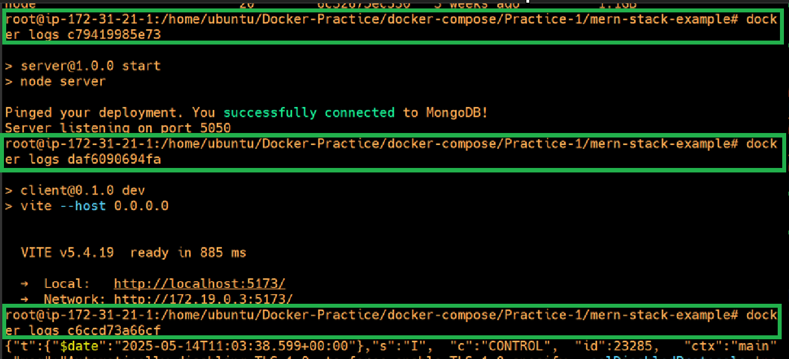

## MERN stack application implementation.

- Project Overview : This project uses the MERN stack, which stands for:
    - M: MongoDB (Database Layer)
    - E: Express.js (Application Logic Layer)
    - R: React.js (Frontend/UI Layer)
    - N: Node.js (Runtime Environment for Backend)

There are two branches in the project:
 - main branch: Provided by the developers, contains the original source code.
 - compose branch: Derived from main, enhanced to support containerization using Docker and Docker Compose.

🔗 Reference : GitHub Repo - MERN Docker Compose : https://github.com/iam-veeramalla/MERN-docker-compose/tree/main 

- **Role of Each Component**

 - MongoDB: Stores application data. It's the database used by the backend.
 - Express.js: Backend web application framework where business logic resides.
 - Node.js: Executes the Express.js application and serves API endpoints.
 - React.js: The frontend that interacts with users and consumes APIs from the backend.

- **General Analogy: Language vs. Dependency File**

| **Language** | **Dependency File** | **Purpose**                                                           |
| ------------ | ------------------- | --------------------------------------------------------------------- |
| Python       | `requirements.txt`  | Lists third-party Python packages to be installed via `pip`.          |
| Java         | `pom.xml`           | Maven configuration file; manages dependencies, build plugins, etc.   |
| Node.js      | `package.json`      | Lists dependencies, scripts, project metadata for npm-based projects. |
| Go           | `go.mod`            | Specifies Go module and its required dependencies (since Go 1.11+).   |
| Rust         | `Cargo.toml`        | Declares Rust project metadata and dependencies (used with Cargo).    |
| Ruby         | `Gemfile`           | Declares Ruby gem dependencies for Bundler.                           |
| PHP          | `composer.json`     | Defines PHP package dependencies for Composer.                        |

- **Dockerization Workflow**

- Create a Dockerfile for both the frontend and backend.
- Set up a custom Docker network so that all three containers can talk to each other.
- Run all Docker commands manually to test individual services.
- Once confirmed, migrate to a single file: docker-compose.yaml.

- **Docker Compose simplifies**

- Multi-container orchestration
<!--
Ques   :   What is Multi-Container Orchestration?
Sol    : 
Multi-container orchestration refers to the coordinated setup, deployment, and management of multiple containers that work together as part of an application. For example, a typical MERN app may have:
    -- A MongoDB container (database)
    -- A Node/Express container (backend)
    -- A React container (frontend)
    -- All of these need to run together, communicate over a network, and may depend on each other in a specific order (e.g., backend depends on database).

-->
- Network configuration
- Volume management
- Dependency ordering (e.g., DB before backend)

- **Docker Compose allows us to do following tasks**

| Feature                     | Description                                                            |
| --------------------------- | ---------------------------------------------------------------------- |
| Define multi-container apps | In a single `docker-compose.yml` file                                  |
| Shared networking           | Containers can communicate by **service name** (e.g., `mongodb:27017`) |
| Define dependencies         | With `depends_on`, you can specify startup order                       |
| Environment configuration   | Using `.env` files or `environment:` section                           |
| Volume and port mapping     | Easily map host paths, persistent volumes, and ports                   |
| Lifecycle commands          | `docker-compose up`, `down`, `logs`, etc., for managing the full app   |

- **Important Notes**

- Firstly we have confgured, frontend container.
- Then we configure and start the MongoDB container first, before one tries to configure backend container since backend container tries to connect the database/mongodb container via connection string on startup.
- Make sure containers are on the same Docker network for hostname-based resolution.
- Use Docker volumes to persist MongoDB data.

#### Docker Commands for Manual Testing

 - **List commands**
  - docker network ls
  - docker images
  - docker volume ls

- **Docker build commands**
 - docker build -t khannashiv/mern-frontend:v1 ./frontend
 - docker build -t khannashiv/mern-backend:v1 ./backend

- **Docker create commands**
 - docker network create mern-app-network

- **Docker run commands**
 - docker run -dit --name=mongodb --network=mern-app-network -v /opt/mongo-db-data/:/opt/data -p 27017:27017 mongo:8.0
 - docker run -dit --name=mern-stack-backend --network=mern-app-network -p 5050:5050 khannashiv/mern-backend:v1
 - docker run -dit --name=mern-stack-frontend --network=mern-app-network -p 5173:5173 khannashiv/mern-frontend:v1

- **Docker container logs**
 - docker logs mongodb
 - docker logs mern-stack-backend
 - docker logs mern-stack-frontend

- **Docker exec commands**
 - docker exec -it mongodb /bin/bash
 - docker exec -it mern-stack-backend /bin/bash
 - docker exec -it mern-stack-frontend /bin/bash

- **Docker rm commands**
 - docker rm -f $(docker ps -aq)
 - docker rmi -f $(docker images -aq)

- Once we have confirmed everything worked locally, we have stop all containers, followed by deleting them and also we have deleted their correspoding docker images.
- Next we have created a compose.yml file which will container all the services i.e. frontend, backend as well as db conatiners all in single YAML file.
- Final outcomes of the project has been attached below in the form of snaps.

- 
- 
- 
- 
- 
- 
- 
- 
- 

